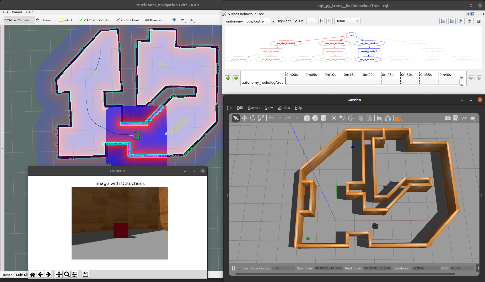

# TurtleBot3 Behavior Demos
In this repository, we demonstrate autonomous behavior using a simulated [ROBOTIS TurtleBot3](https://emanual.robotis.com/docs/en/platform/turtlebot3/overview/#overview) using Ubuntu 20.04 and ROS Noetic.

This also serves as an example for Docker + Make workflows in ROS based projects. For more information, refer to the accompanying blog post (TODO).

By Sebastian Castro, 2021

---

## Setup
First, install Docker using [the official install guide](https://docs.docker.com/engine/install/ubuntu/).

To run Docker containers with graphics and GPU support, you will also need the [NVIDIA Container Toolkit](https://github.com/NVIDIA/nvidia-docker).

To use GUI based tools (e.g., RViz, Gazebo) inside Docker, there is additional setup required. The simplest way is to run the command below each time you log into your machine, but there is a more detailed walkthrough of options in the [ROS Wiki](http://wiki.ros.org/docker/Tutorials/GUI).

```
xhost +
```

---

## Usage
First, build the base and overlay Docker images. This will take a while.

```
make build
```

To enter a Terminal in the overlay container:

```
make term
```

You can verify that display in Docker works by starting a basic Gazebo simulation included in the standard TurtleBot3 packages:

```
make sim
```

To start our demo world and autonomous behaviors:

```
make demo-world
make demo-behavior TARGET_COLOR=green
```

After starting the commands above (plus doing some waiting and window rearranging), you should see the following.


