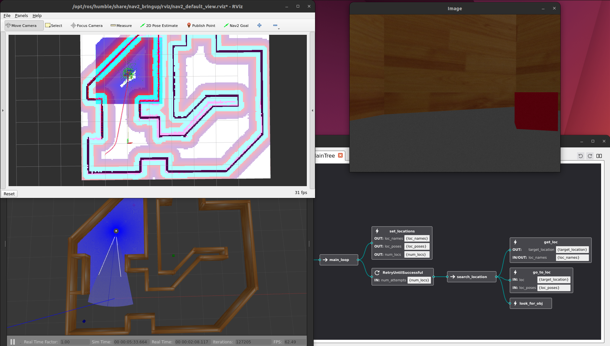

# TurtleBot3 Behavior Demos
In this repository, we demonstrate autonomous behavior with a simulated [ROBOTIS TurtleBot3](https://emanual.robotis.com/docs/en/platform/turtlebot3/overview/#overview) using Ubuntu 20.04 and ROS Noetic.

The autonomy in these examples are designed using **behavior trees**. For more information, refer to [this blog post](https://roboticseabass.com/2021/05/08/introduction-to-behavior-trees/) or the [Behavior Trees in Robotics and AI textbook](https://arxiv.org/abs/1709.00084).

This also serves as an example for Docker + Make workflows in ROS based projects. For more information, refer to [this blog post](https://roboticseabass.com/2021/04/21/docker-and-ros/).

By Sebastian Castro, 2021

---

## Setup
First, install Docker using [the official install guide](https://docs.docker.com/engine/install/ubuntu/).

To run Docker containers with graphics and GPU support, you will also need the [NVIDIA Container Toolkit](https://github.com/NVIDIA/nvidia-docker).

To use GUI based tools (e.g., RViz, Gazebo) inside Docker, there is additional setup required. The simplest way is to run the command below each time you log into your machine, but there is a more detailed walkthrough of options in the [ROS Wiki](http://wiki.ros.org/docker/Tutorials/GUI).

```
xhost + local:docker
```

Technically, you should be able to bypass Docker, directly clone this package to a Catkin workspace, and build it provided you have the necessary dependencies. As long as you can run the examples in the [TurtleBot3 manual](https://emanual.robotis.com/docs/en/platform/turtlebot3/overview/#overview), you should be in good shape.

First, clone this repository and go into the top-level folder:

```
git clone https://github.com/sea-bass/turtlebot3_behavior_demos.git
cd turtlebot3_behavior_demos
```

Build the base and overlay Docker images. This will take a while and requires approximately 4 GB of disk space.

```
make build
```

---

## Basic Usage
We use `make` to automate building, as shown above, but also for various useful entry points into the Docker container once it has been built. **All `make` commands below should be run from your host machine, and not from inside the container**.

To enter a Terminal in the overlay container:

```
make term
```

If you have an NVIDIA GPU and want to give your container access to the devices, add the following argument (this is true for all targets):

```
make term USE_GPU=true
```

You can verify that display in Docker works by starting a basic Gazebo simulation included in the standard TurtleBot3 packages:

```
make sim
```

---

## Behavior Trees Demo
In this example, the robot navigates around known locations with the goal of finding a block of a specified color (red, green, or blue). Object detection is done using simple thresholding in the [HSV color space](https://en.wikipedia.org/wiki/HSL_and_HSV) with calibrated values.

To start the demo world, run the following command:

```
make demo-world
```

### Behavior Trees in Python

To start the Python based demo, which uses [`py_trees`](https://py-trees.readthedocs.io/en/devel/):

```
make demo-behavior
```

You can also include arguments: 

```
make demo-behavior TARGET_COLOR=green BT_TYPE=queue USE_GPU=true
```

Note that the behavior tree viewer ([`rqt_py_trees`](https://github.com/splintered-reality/rqt_py_trees)) does not select topics automatically. To view the tree, you should use the drop-down list to select the `/autonomy_node/log/tree` topic.

After starting the commands above (plus doing some waiting and window rearranging), you should see the following. The labeled images will appear once the robot reaches a target location.


### Behavior Trees in C++

To start the C++ demo, which uses [`BehaviorTrees.CPP`](https://www.behaviortree.dev/):

```
make demo-behavior-cpp
```

You can also include arguments: 

```
make demo-behavior-cpp TARGET_COLOR=green BT_TYPE=queue USE_GPU=true
```

Note that the behavior tree viewer ([`Groot`](https://github.com/BehaviorTree/Groot)) requires you to click the "Connect" button to display the active tree.

After starting the commands above (plus doing some waiting and window rearranging), you should see the following. The labeled images will appear once the robot reaches a target location.


